<p align="center">
  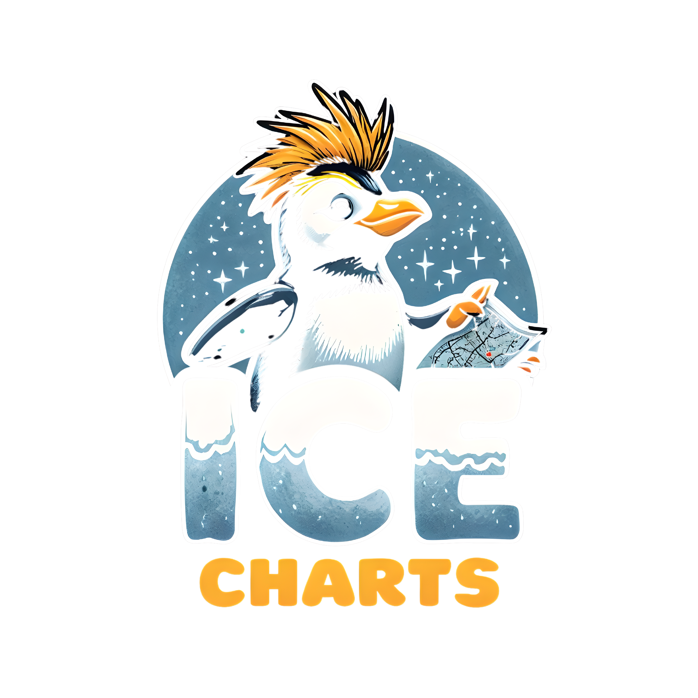
</p>

<p align="center">
  <a href="https://github.com/penguintechinc/IceCharts/actions/workflows/ci.yml"></a>
  <a href="https://github.com/penguintechinc/IceCharts/actions/workflows/docker-multiarch.yml"></a>
  <a href="https://github.com/penguintechinc/IceCharts/actions/workflows/test-and-lint.yml"></a>
  <a href="https://semver.org"></a>
  <a href="LICENSE.md"></a>
</p>

# IceCharts

**Create. Collaborate. Export. Visualize Infrastructure and Diagrams.**

IceCharts is a modern, web-based collaborative diagramming platform designed for creating, sharing, and exporting visual representations of infrastructure, system architectures, flowcharts, and organizational structures. Built with enterprise-grade features including real-time collaboration, version control, and seamless infrastructure integration.

## Screenshots

<p align="center">
  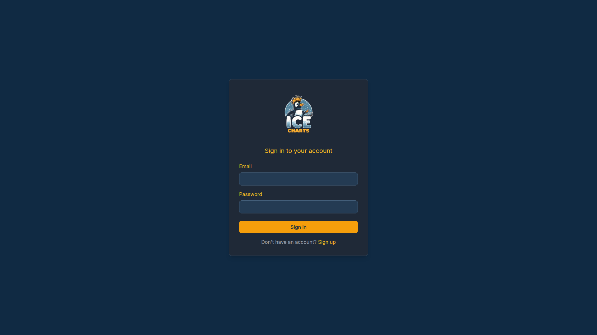
  <br><em>Login Page</em>
</p>

<p align="center">
  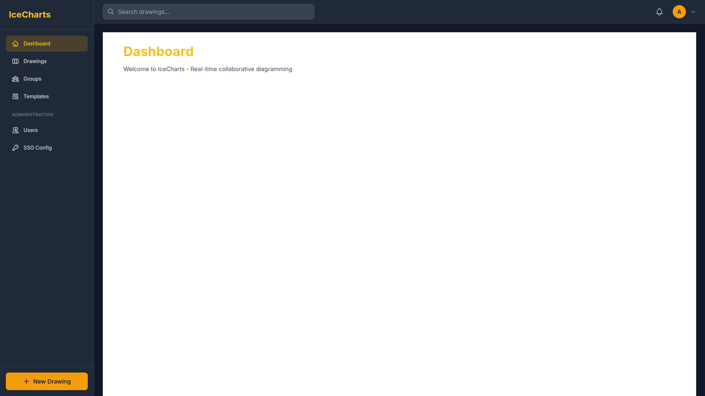
  <br><em>Dashboard - Overview of recent activity and drawings</em>
</p>

<p align="center">
  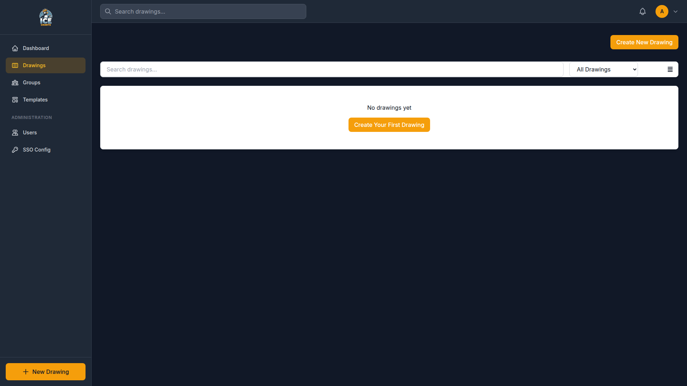
  <br><em>Drawings - Manage and organize your diagrams</em>
</p>

<p align="center">
  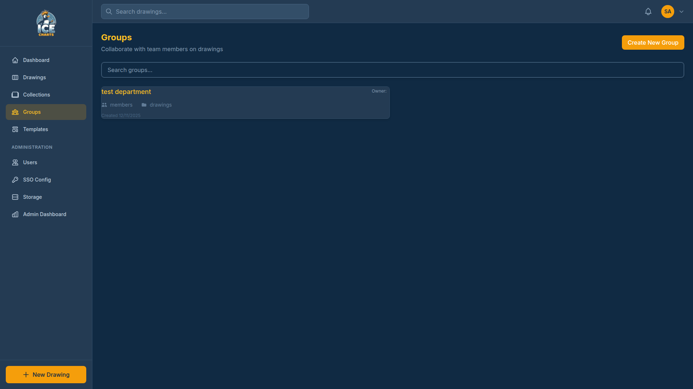
  <br><em>Groups - Collaborate with teams</em>
</p>

<p align="center">
  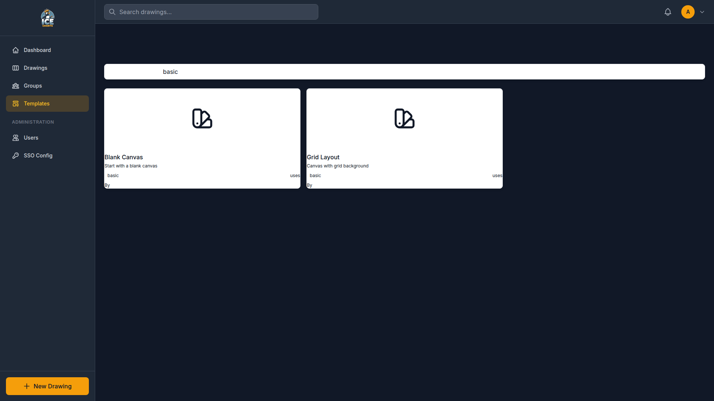
  <br><em>Templates - Start from pre-built diagram templates</em>
</p>

<p align="center">
  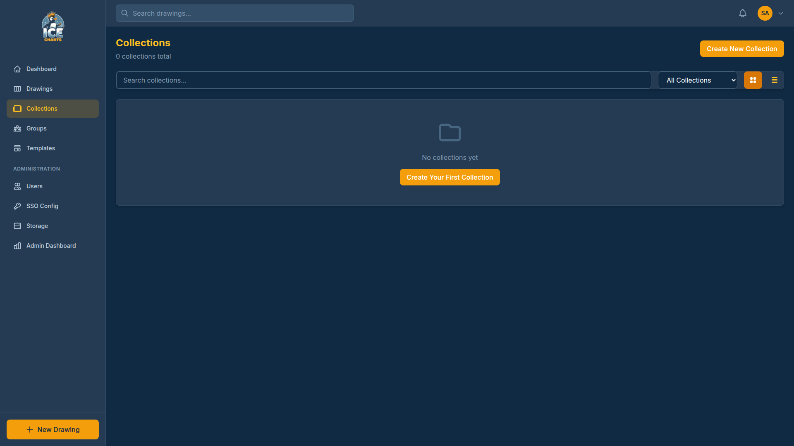
  <br><em>Collections - Organize diagrams into collections</em>
</p>

<p align="center">
  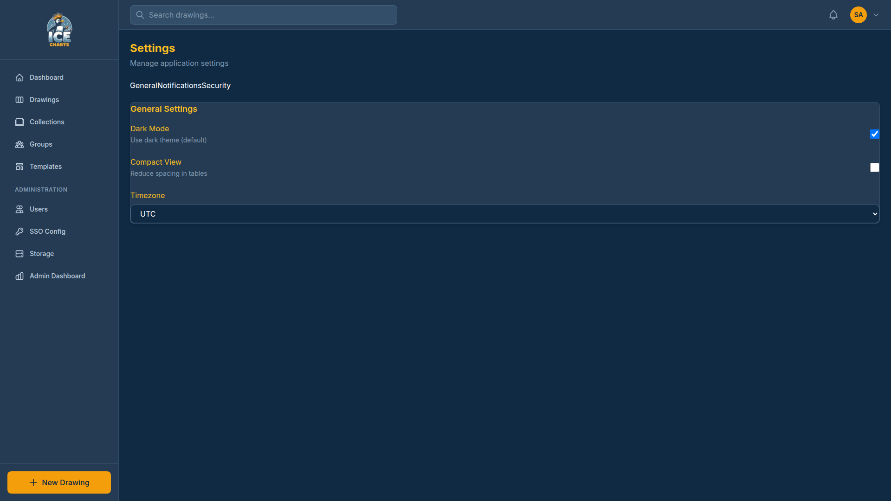
  <br><em>Settings - Configure your account and preferences</em>
</p>

<p align="center">
  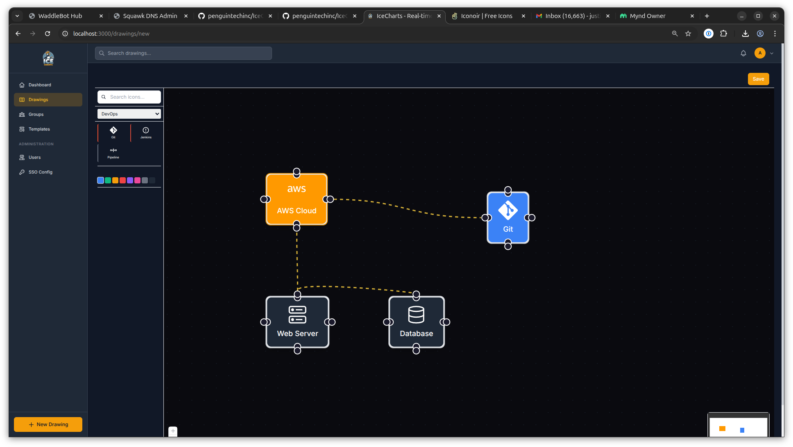
  <br><em>Dynamic and flow animated diagrams with thousands of icons - Make your diagrams accurate and alive!</em>
</p>

### Administration

<p align="center">
  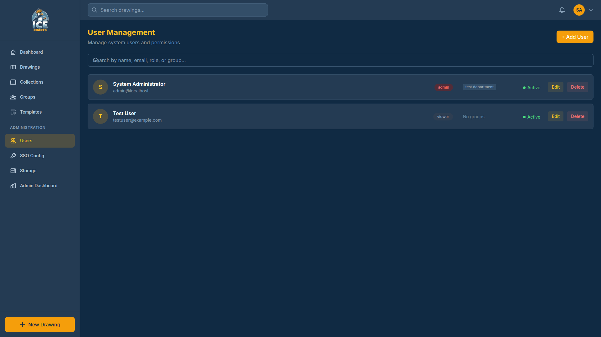
  <br><em>User Management - Administer users and roles</em>
</p>

<p align="center">
  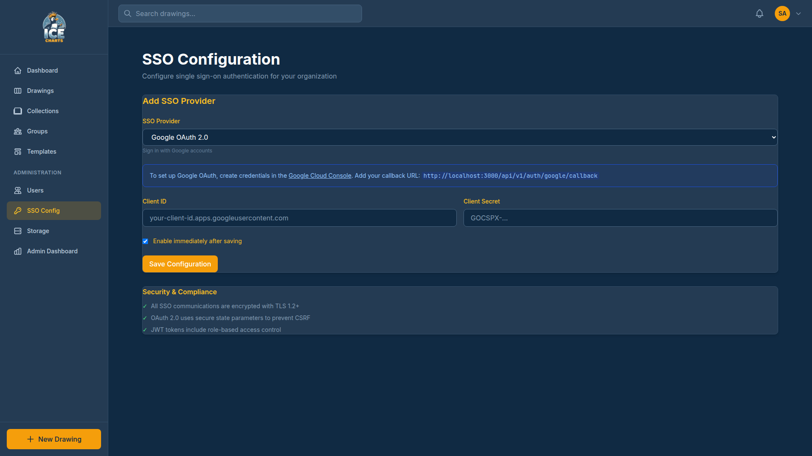
  <br><em>SSO Configuration - Configure Google OAuth, SAML, and OIDC authentication</em>
</p>

<p align="center">
  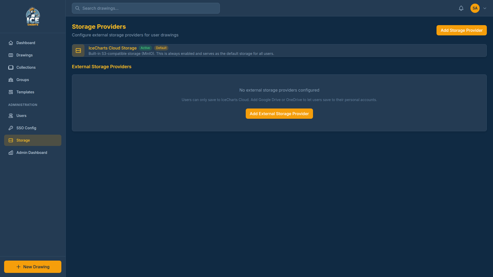
  <br><em>Storage Management - Monitor and manage storage usage</em>
</p>

<p align="center">
  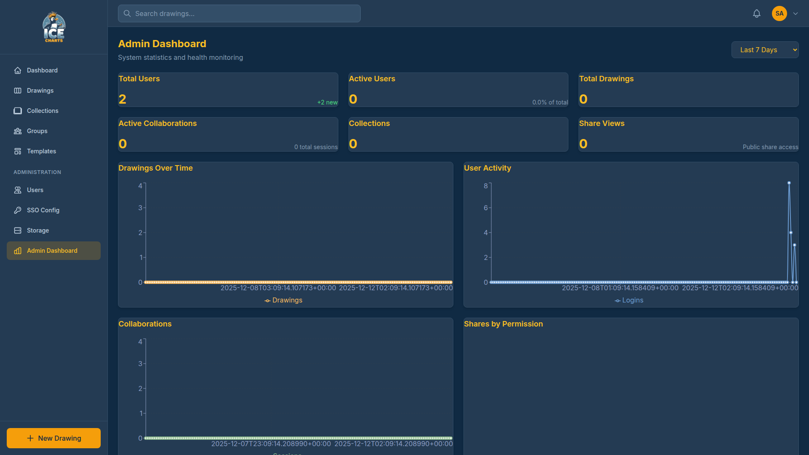
  <br><em>Admin Dashboard - System statistics and monitoring</em>
</p>

## Key Features

### Canvas & Drawing
- **Intuitive canvas editor** for creating diagrams with shapes, connectors, and text
- **Rich shape library** for system components, infrastructure, and flowchart elements
- **Smart connectors** with automatic routing and customizable styling
- **Grid & snap-to-grid** for precise alignment and professional layouts

### Real-Time Collaboration
- **Multi-user editing** with WebSocket-powered real-time synchronization
- **Presence awareness** - see who's editing and where
- **Comments & annotations** with threaded discussions on specific elements
- **Resolution tracking** for design reviews and feedback cycles

### Export & Sharing
- **Multiple export formats** (SVG, PNG, PDF, JSON)
- **Customizable export options** with scaling and resolution settings
- **Public sharing links** for easy distribution and feedback
- **Version history** with rollback capabilities

### Infrastructure Integration
- **Elder API integration** to import infrastructure entities as diagram shapes
- **Automatic entity mapping** with color-coding by component type
- **Dependency visualization** showing relationships between infrastructure elements
- **Live sync** with infrastructure definitions

### Workflow Automation (IceStreams)
- **Visual workflow editor** with drag-and-drop node canvas
- **Connector Framework** for integrating external services
- **WaddleBot integration** for chat bot automation (Twitch, Discord, Slack, Kick)
- **Triggers, Actions, and Transforms** for building automation pipelines
- **Schema-driven configuration** for easy node setup

### Enterprise Security
- **User authentication & authorization** with role-based access control (RBAC)
- **OAuth/SSO integration** for enterprise identity management
- **Team & group management** with granular permissions
- **Audit logging** for compliance and accountability

### High Performance
- **PostgreSQL database** with optimized queries and indexing
- **Redis caching** for instant response times
- **MinIO object storage** for efficient file management
- **Prometheus monitoring** with Grafana dashboards

## Getting Started

### Prerequisites
- Docker and Docker Compose
- Node.js 18+ (for local frontend development)
- Python 3.12+ (for local backend development)
- Git

### Quick Start with Docker Compose

```bash
# Clone the repository
git clone https://github.com/penguintechinc/IceCharts.git
cd IceCharts

# Copy environment template and configure if needed
cp .env.example .env

# Start all services
docker-compose up -d

# Access the application
# Web UI: http://localhost:3000
# API: http://localhost:5001
# Default credentials: admin@localhost.local / admin123
```

### Local Development Setup

```bash
# Install dependencies and setup environment
make setup

# Start development services
make dev

# Run tests
make test

# Build for production
make build
```

## Documentation

Comprehensive documentation is available in the [docs/](docs/) directory:

- **[Getting Started](docs/GETTING_STARTED.md)** - Setup, configuration, and first steps
- **[Architecture](docs/ARCHITECTURE.md)** - System design and component overview
- **[API Reference](docs/API_REFERENCE.md)** - Complete API documentation
- **[Features Guide](docs/FEATURES.md)** - Detailed feature documentation
  - [Canvas & Drawing](docs/FEATURES.md#canvas--drawing)
  - [Collaboration](docs/FEATURES.md#real-time-collaboration)
  - [Comments System](docs/COMMENTS_SYSTEM.md)
  - [Export Functionality](docs/EXPORT_FUNCTIONALITY.md)
  - [Elder Integration](docs/ELDER_INTEGRATION.md)
- **[Connector Framework](docs/CONNECTORS.md)** - External service integration guide
  - [Creating Connectors](docs/CONNECTORS.md#creating-a-new-connector)
  - [WaddleBot Integration](docs/CONNECTORS.md#waddlebot)
  - [Manifest Schema Reference](docs/CONNECTORS.md#manifest-schema-reference)
- **[Kubernetes Deployment](docs/KUBERNETES.md)** - Helm charts, Kustomize manifests, and cloud deployments (AWS/GCP/Azure)
- **[Deployment](docs/DEPLOYMENT.md)** - Deployment guides and best practices
- **[Contributing](docs/CONTRIBUTING.md)** - Development guidelines and workflow
- **[License Integration](docs/licensing/license-server-integration.md)** - License management
- **[Testing](docs/TESTING.md)** - Testing strategies and test execution
- **[Docker Setup](docs/DOCKER_SETUP.md)** - Docker-specific configuration

## Technology Stack

| Component | Technology | Version |
|-----------|-----------|---------|
| **Frontend** | React, TypeScript, Tailwind CSS | 18+, Latest, 3.x |
| **Backend** | Flask, Python, PyDAL | Latest, 3.12+, Latest |
| **Database** | PostgreSQL | 17+ |
| **Cache** | Redis | 7+ |
| **Storage** | MinIO (S3-compatible) | Latest |
| **Monitoring** | Prometheus, Grafana | Latest, Latest |
| **Containers** | Docker, Docker Compose | Latest |

## Contributing

We welcome contributions! Please see [CONTRIBUTING.md](docs/CONTRIBUTING.md) for guidelines, development workflow, and code standards.

### Development Team
- **Company**: [Penguin Tech Inc](https://www.penguintech.io)
- **Support**: info@penguintech.group
- **Issues & Questions**: [GitHub Issues](https://github.com/penguintechinc/IceCharts/issues)

## Support & Resources

- **Full Documentation**: [docs/](docs/)
- **API Documentation**: [docs/API_REFERENCE.md](docs/API_REFERENCE.md)
- **Support Email**: support@penguintech.group
- **Issue Tracker**: [GitHub Issues](https://github.com/penguintechinc/IceCharts/issues)
- **License Server**: https://license.penguintech.io

## License

This project is licensed under the Limited AGPL3 with preamble for fair use - see [LICENSE.md](docs/LICENSE.md) for details.

**License Highlights:**
- **Personal & Internal Use**: Free under AGPL-3.0
- **Commercial Use**: Requires commercial license
- **SaaS Deployment**: Requires commercial license if providing as a service

### Contributor Employer Exception (GPL-2.0 Grant)

Companies employing official contributors receive GPL-2.0 access to community features:

- **Perpetual for Contributed Versions**: GPL-2.0 rights to versions where the employee contributed remain valid permanently, even after the employee leaves the company
- **Attribution Required**: Employee must be credited in CONTRIBUTORS, AUTHORS, commit history, or release notes
- **Future Versions**: New versions released after employment ends require standard licensing
- **Community Only**: Enterprise features still require a commercial license

This exception rewards contributors by providing lasting fair use rights to their employers. See [LICENSE.md](docs/LICENSE.md) for full terms.
